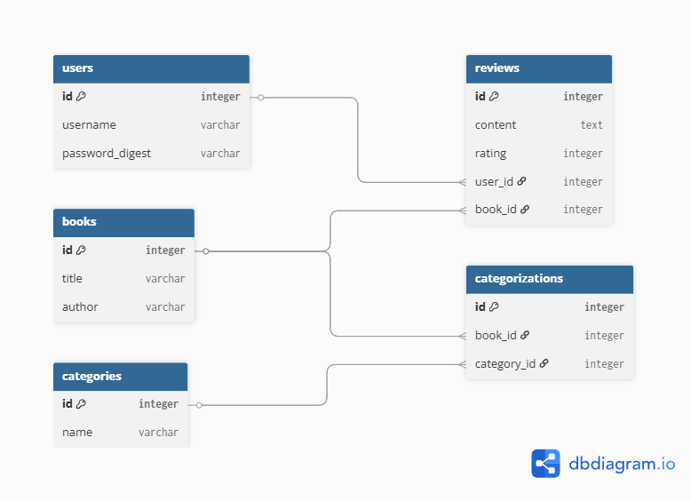

# Book Review Application (phase 2)

## Project Overview

This is a Ruby on Rails web application that allows users to browse books and write reviews.  
The application follows the MVC architecture and demonstrates core concepts covered in the course, including model relationships, authentication, sessions, and nested resources.

---

## Features

- User authentication (sign up, login, logout)
- Browse a collection of books
- View detailed information about each book
- Write reviews for books (only for logged-in users)
- Book categorization using a many-to-many relationship
- Responsive and styled user interface with CSS

---

## Models

The application includes the following models:

- **User**
    - Has many reviews
    - Uses secure password authentication

- **Book**
    - Has many reviews
    - Has many categories through categorizations

- **Review**
    - Belongs to a user
    - Belongs to a book

- **Category**
    - Has many books through categorizations

- **Categorization**
    - Join table for books and categories (many-to-many relationship)

---

## Relationships

The application implements multiple types of relationships:

- One-to-Many:
    - User -> Reviews
    - Book -> Reviews

- Many-to-Many:
    - Book & Category (through Categorization)
## ER Diagram



---

## Authentication

- Authentication is implemented from scratch using `has_secure_password`
- Users can sign up, log in, and log out
- Sessions are used to track logged-in users
- Only authenticated users can create reviews

---

## Nested Resources

Reviews are implemented as nested resources under books: /books/:book_id/reviews

---

## Seed Data

The application includes realistic seed data:

- 20+ books
- Multiple authors (e.g., J.K. Rowling, George Orwell)
- Meaningful category assignments (e.g., Fantasy, Sci-Fi, Classic)
- Sample user account

---
## API Endpoints

This project also includes a JSON-based API for user authentication and book data retrieval.

### 1. User Signup

**Endpoint:** `POST /api/signup`

**Description:**  
Create a new user account.

**Request Body:**
```json
{
  "username": "alice",
  "email": "alice@example.com",
  "password": "123456",
  "password_confirmation": "123456"
}
```

### 2. User Login

**Endpoint:** `POST /api/login`

**Description:**
Log in with an existing user account.

**Request Body:**
```json
{
"email": "test@example.com",
"password": "123456"
}
```

### 3. Get All Books

**Endpoint:** `GET /api/books`

**Description:**
Return a list of all books with their categories.

### 4. Get Book Details

**Endpoint:** `GET /api/books/:id`

**Description:**
Return detailed information for one book, including categories and reviews.

**Example:** `GET /api/books/1`

### 5. Get Categories

**Endpoint:** `GET /api/categories`

**Description:**
Return a list of all categories.

---

## Deployment

The application is deployed on Heroku.

Live URL: https://final-project-phase-1-4b87f7452e5b.herokuapp.com/

